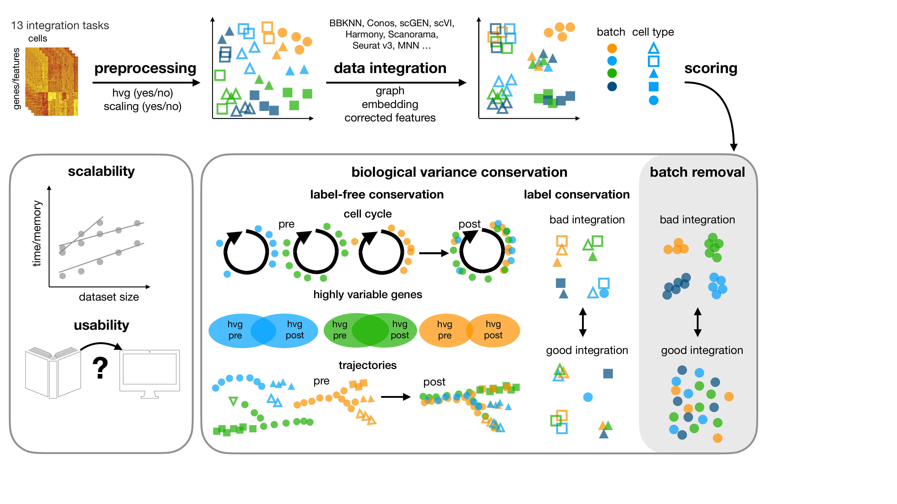
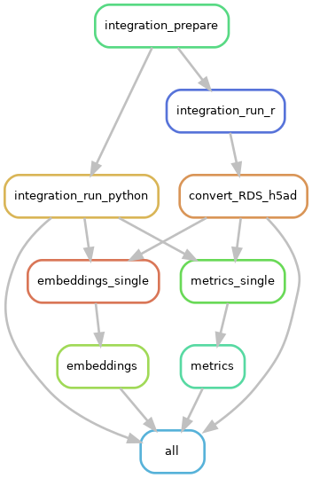

# Pipeline for benchmarking atlas-level single-cell integration

> [!IMPORTANT]
> This pipeline was tailored for the scib integration benchmark, but is not being developed for general-purpose dataset integration and benchmarking.
> There are two follow-up project from this benchmkark that you can check out instead:
> 
> 1. For a more up-to-date project on across-dataset benchmarking of scRNA batch integration, please visit the **Openproblems living benchmark** [website](https://openproblems.bio/results/batch_integration_feature/) or [repo](https://github.com/openproblems-bio/task_batch_integration).
> 2. If you want to **build your own integrated atlas** or make use of a ready-to-use integration benchmark, please visit the more extensive and highly scalable atlas building pipeline: https://github.com/HCA-integration/sc-atlasing-toolbox

This repository contains the snakemake pipeline for our benchmarking study for data integration tools.
In this study, we benchmark 16 methods ([see here](##tools)) with 4 combinations of preprocessing steps leading to 68 
methods combinations on 85 batches of gene expression and chromatin accessibility data.
The pipeline uses the [`scib`](https://github.com/theislab/scib.git) package and allows for reproducible and automated
analysis of the different steps and combinations of preprocesssing and integration methods.



## Resources

- On our [website](https://theislab.github.io/scib-reproducibility) we visualise the results of the study.

- The scib package that is used in this pipeline can be found [here](https://github.com/theislab/scib).

- For reproducibility and visualisation we have a dedicated repository: [scib-reproducibility](https://github.com/theislab/scib-reproducibility).

- The data used in the study on  [figshare](https://figshare.com/articles/dataset/Benchmarking_atlas-level_data_integration_in_single-cell_genomics_-_integration_task_datasets_Immune_and_pancreas_/12420968)

### Please cite:

Luecken, M.D., Büttner, M., Chaichoompu, K. et al. Benchmarking atlas-level data integration in single-cell genomics.
Nat Methods 19, 41–50 (2022). https://doi.org/10.1038/s41592-021-01336-8

## Installation

To reproduce the results from this study, two separate conda environments are needed for python and R operations.
Please make sure you have either [`mambaforge`](https://github.com/conda-forge/miniforge) or
[`conda`](https://conda.io/projects/conda) installed on your system to be able to use the pipeline.
We recommend using [`mamba`](https://mamba.readthedocs.io), which is also available for conda, for faster package
installations with a smaller memory footprint.

We provide python and R environment YAML files in `envs/`, together with an installation script for setting up the
correct environments in a single command. based on the R version you want to use.
The pipeline currently supports R 3.6 and R 4.0, and we generally recommend using version R 4.0.
Call the script as follows e.g. for R 4.0

```shell
bash envs/create_conda_environments.sh -r 4.0
```

Check the script's help output in order to get the full list of arguments it uses.

```shell
bash envs/create_conda_environments.sh -h 
```

Once installation is successful, you will have the python environment `scib-pipeline-R<version>` and the R environment
`scib-R<version>` that you must specify in the [config file](#setup-configuration-file).

| R version | Python environment name | R environment name | Test data config YAML file   |
|-----------|-------------------------|--------------------|------------------------------|
| 4.0       | `scib-pipeline-R4.0`    | `scib-R4.0`        | `configs/test_data-R4.0.yml` |
| 3.6       | `scib-pipeline-R3.6`    | `scib-R3.6`        | `configs/test_data-R3.6.yml` |

> **Note**: The installation script only works for the environments listed in the table above.
> The environments used in our [study][paper] are included for reproducibility purposes and are described in `envs/`.

For a more detailed description of the environment files and how to install the different environments manually, please
refer to the README in `envs/`.


## Running the Pipeline

This repository contains a [snakemake](https://snakemake.readthedocs.io/en/stable/) pipeline to run integration methods
and metrics reproducibly for different data scenarios preprocessing setups.

### Generate Test data

A script in `data/` can be used to generate test data.
This is useful, in order to ensure that the installation was successful before moving on to a larger dataset.
The pipeline expects an `anndata` object with normalised and log-transformed counts in `adata.X` and counts in
`adata.layers['counts']`.
More information on how to use the data generation script can be found in `data/README.md`.

### Setup Configuration File

The parameters and input files are specified in config files.
A description of the config formats and example files can found in `configs/`.
You can use the example config that use the test data to get the pipeline running quickly, and then modify a copy of it
to work with your own data.

### Pipeline Commands

To call the pipeline on the test data e.g. using R 4.0

```shell
snakemake --configfile configs/test_data-R4.0.yaml -n
```

This gives you an overview of the jobs that will be run.
In order to execute these jobs with up to 10 cores, call

```shell
snakemake --configfile configs/test_data-R4.0.yaml --cores 10
```

More snakemake commands can be found in the [documentation](snakemake.readthedocs.io/).

### Visualise the Workflow

A dependency graph of the workflow can be created anytime and is useful to gain a general understanding of the workflow.
Snakemake can create a `graphviz` representation of the rules, which can be piped into an image file.

```shell
snakemake --configfile configs/test_data-R3.6.yaml --rulegraph | dot -Tpng -Grankdir=TB > dependency.png
```



## Tools

Tools that are compared include:

- [Scanorama](https://github.com/brianhie/scanorama)
- [scANVI](https://github.com/chenlingantelope/HarmonizationSCANVI)
- [FastMNN](https://bioconductor.org/packages/batchelor/)
- [scGen](https://github.com/theislab/scgen)
- [BBKNN](https://github.com/Teichlab/bbknn)
- [scVI](https://github.com/YosefLab/scVI)
- [Seurat v3 (CCA and RPCA)](https://github.com/satijalab/seurat)
- [Harmony](https://github.com/immunogenomics/harmony)
- [Conos](https://github.com/hms-dbmi/conos) [tutorial](https://htmlpreview.github.io/?https://github.com/satijalab/seurat.wrappers/blob/master/docs/conos.html)
- [Combat](https://scanpy.readthedocs.io/en/stable/api/scanpy.pp.combat.html) [paper](https://academic.oup.com/biostatistics/article/8/1/118/252073)
- [MNN](https://github.com/chriscainx/mnnpy)
- [TrVae](https://github.com/theislab/trvae)
- [DESC](https://github.com/eleozzr/desc)
- [LIGER](https://github.com/MacoskoLab/liger)
- [SAUCIE](https://github.com/KrishnaswamyLab/SAUCIE)


[paper]: https://doi.org/10.1038/s41592-021-01336-8
